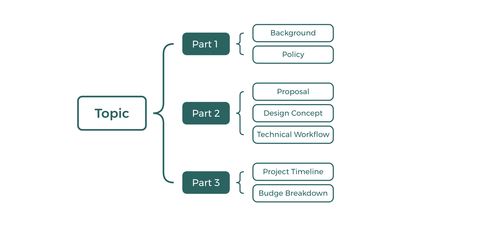
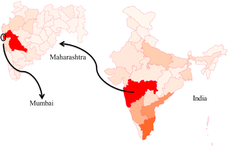
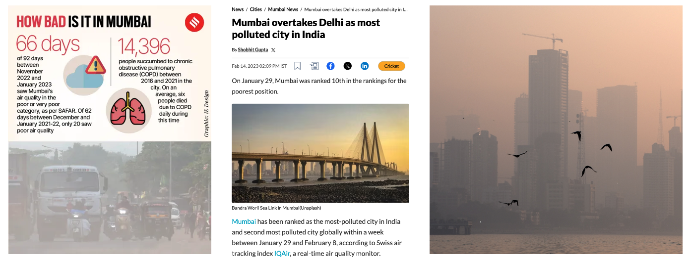
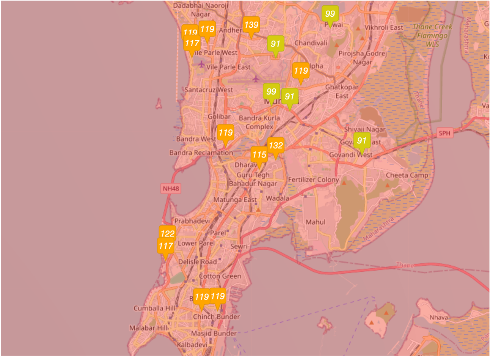
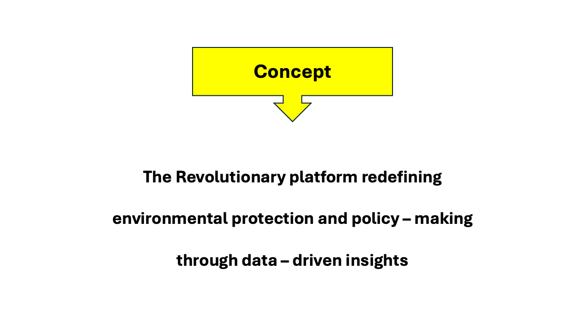
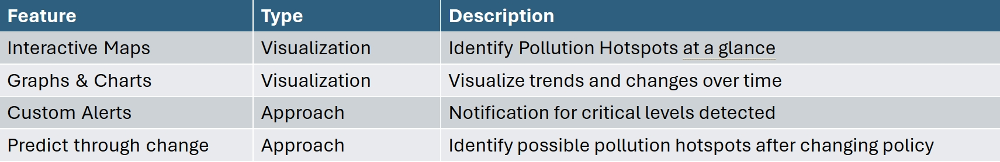
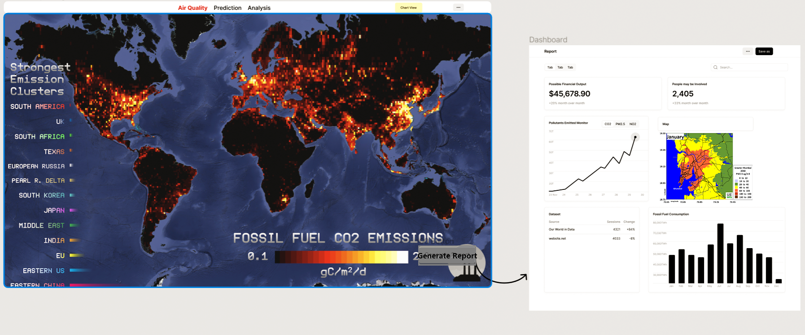
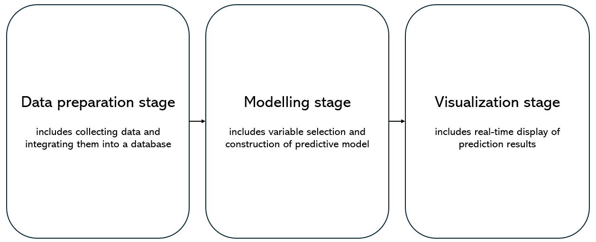
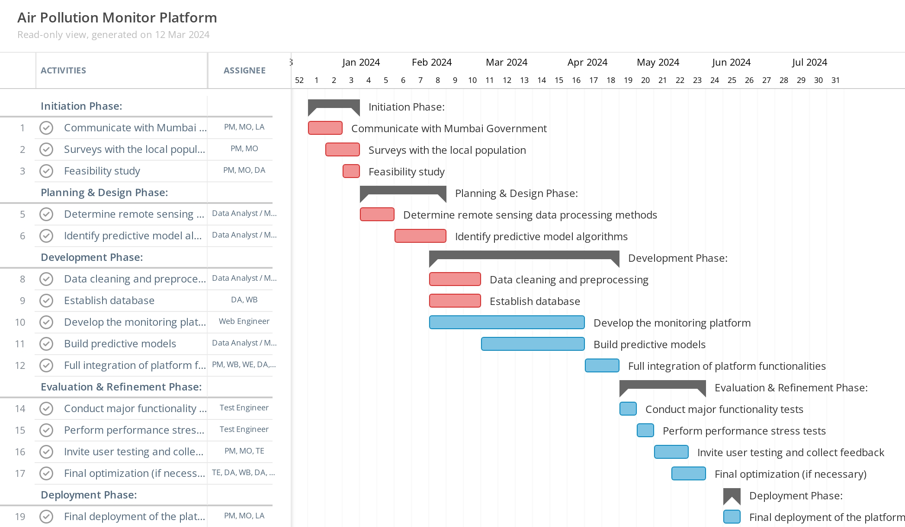
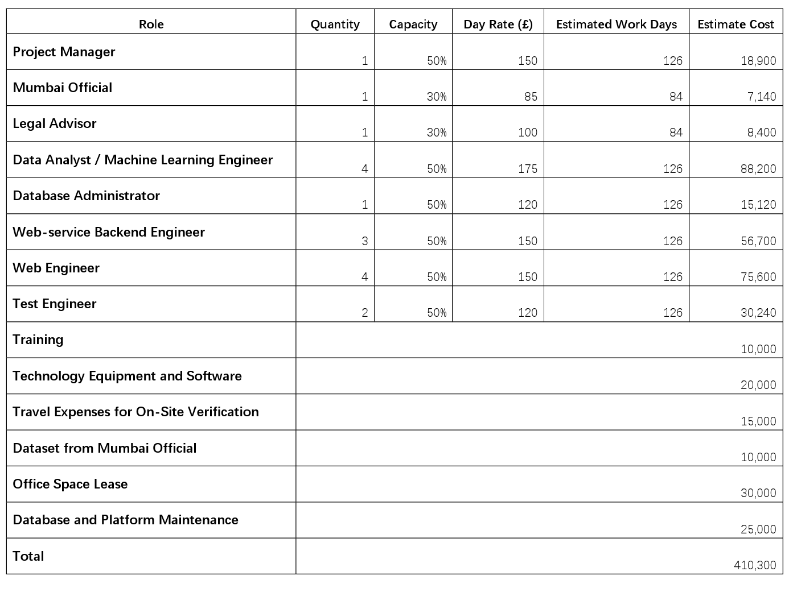

---
output:
  xaringan::moon_reader:
    css: xaringan-themer.css  
    lib_dir: libs
    nature:
      highlightStyle: github
      highlightLines: true
      ratio: 16:9
      countIncrementalSlides: false
---

```{r xaringan-all, echo=FALSE, message=FALSE, warning=FALSE, results='hide'}
library(xaringan)
library(xaringanExtra)
library(knitr)
library(RefManageR)
library(knitcitations)
library(tidyverse)
library(knitr)
library(kableExtra)
library(readxl)
library(fs)
library(here)
```


```{r echo=FALSE}
BibOptions(check.entries = FALSE,
           bib.style = "authoryear",
           cite.style = "authoryear",
           style = "markdown",
           hyperlink = TRUE,
           dashed = FALSE,
           no.print.fields=c("doi", "url", "urldate", "issn"))
myBib <- ReadBib("./CASA0023_Group_Presentation.bib", check = FALSE)
```

```{r xaringan-themer, include=FALSE, warning=FALSE}
library(xaringanthemer)
style_duo_accent(
  primary_color = "#1381B0",
  secondary_color = "#FF961C",
  inverse_header_color = "#FFFFFF"
)
```

class: center, title-slide, middle

background-image: url("Figure/Other/in-mumbai pollution.jpg")
background-size: cover
background-position: center

# <span style="color:white;">Breathing Life into Data: Revolutionizing Mumbai Air Quality with Smart Technology</span>
## <span style="color:white;">CASA0023<br/>Group Project</span>
### <span style="color:white;">Team XYZ</span>

### <span style="color:white;">`r format(Sys.time(), "%d/%m/%Y")`</span>

---
## Contents
```{r echo=FALSE,out.width='100%',fig.align='center'}

```

---
class: center, middle
# Part 1 – 1 Background

---
## Background - Location
Located on the west coast of India. Financial centre, the second largest city in India.

```{r echo=FALSE,out.width='55%',fig.align='center'}

```
.normal-font[
Source: [Kumar, 2020](https://www.researchgate.net/figure/Geographical-location-of-Mumbai-and-total-confirmed-cases-as-on-July-25-2020-This-map_fig1_344086001)
]

---
## Background - Identified the Problem
Air pollution in Mumbai has become a significant concern, particularly in the last decade, as the city has experienced an increase in pollution levels. The Swiss IQAir Group ranks Mumbai as the sixth most polluted city in the world.

```{r echo=FALSE, out.width='90%', fig.align='center'}

```

Source: [Bloomberg,2023](file:///Users/liuzhengyong/Zotero/storage/CMV4YPQA/https://www.bloomberg.com/news/newsletters/2023-01-30/mumbai-s-skyrocketing-pollution-set-to-worsen-health-crisis?embedded-checkout=true) 


---
## Background - Where the pollution comes from? 
```{r xaringan-panelset-1, echo=FALSE}
xaringanExtra::use_panelset()
```

.panelset[
.panel[.panel-name[**Waste Incineration**]
* **7,000-7,500 metric tons** of solid waste per day.

* Toxic fumes may pose a hazard to the area within **5-10 km** of the landfill site.

* Toxic fumes from the burning of waste can travel within a **radius of 15 km**.

* **78% of people** living near landfills are likely to be exposed to high levels of pollution from landfill sites.

Source: [The Indian Express,2023](https://indianexpress.com/article/cities/mumbai/mumbai-holds-its-breath-alarm-bells-ring-but-no-ones-listening-8991358/)

Source: [Anjana Pasricha,2023](https://www.voanews.com/a/mumbai-becomes-second-indian-mega-city-to-battle-dirty-air/7334181.html)
]

.panel[.panel-name[**Transport and large-scale urban construction**]
* **80%** of Mumbai's carbon emissions come from road transport.

* Paved and unpaved roads **Dust**.

* **6,000 sites** with ongoing construction activities.

* Dust pollution from metro construction accounts for **3%** of the total pollution.

* Construction works account for **8%** of total emissions.

Source: [mint, 2023](https://www.livemint.com/news/world/china-asks-banks-insurers-in-hong-kong-to-reveal-lgfv-holdings-11710445044497.html)

Source: [Time of India, 2023](https://timesofindia.indiatimes.com/city/mumbai/why-mumbai-is-getting-a-choking-feeling-like-delhi/articleshow/105051675.cms)

Source: [The Indian Express, 2023](https://indianexpress.com/article/opinion/columns/in-mumbai-clearing-the-dust-lifting-the-haze-9011135/)
]

.panel[.panel-name[**Slums and industrial pollution**]
* Industrial and power plant emissions account for about **36%** of total pollution.

* Slums are home to **more than 50%** of the city's population.

* The use of fuel for living in slums is responsible for about **27%** of pollution.

* Pollution is exacerbated by poor ventilation and the presence of indoor emission sources.

Source: [IndiaSpend, 2023](https://www.indiaspend.com/pollution/why-mumbai-had-poor-air-quality-in-october-880329)

Source: [Times of India, 2023](https://timesofindia.indiatimes.com/india/is-wind-direction-to-blame-for-mumbais-air-pollution/articleshow/105041205.cms)
]
]

---
## Background - What impact behind on this problem

| Aspect           | Details                                                                                                           |
|------------------|-------------------------------------------------------------------------------------------------------------------|
| **Economic**     | - Estimated annual loss of about $150 million (2021)<br>- Average claim amounts for infectious diseases increased from about INR 30,000 to nearly 80,000 (2023)<br>- Cost of treatment for common diseases requiring hospitalization doubled in five years (2023)<br>- Indian hotels and tourism industry suffered three-quarters of economic losses, estimated at 150 billion INR (2022) |
| **Environmental**| - Mumbai, with a population of over 20 million, shrouded in heavy smog for consecutive days (2021)<br>- Over 90% live in areas where air quality is below WHO standards (2022)<br>- Multidimensional pollution affecting ecology, water sources, etc.|
| **Human Life**| - “Significant increase” in patients visiting for respiratory diseases (2022)<br>- 25% increase in outpatient cases related to such diseases (2023)<br>- Doctors deal with 4,000 cases of diphtheria and typhoid daily (2023)                                               |

---
class: center, middle
# Part 1 – 2 Policies

---
## Policies - Global Agendas

**Global Agendas Alignment**: United Nations Framework Convention on Climate Change (UNFCCC) Article 4, New Urban Agenda (65, 75, 79), and SDGs (3, 11, 13).

.panelset[
.panel[.panel-name[**UNFCCC I**]

**Chapter 4 Commitment**

* (b) Formulate, implement, publish and regularly update national and, where appropriate, regional programmes containing measures to mitigate climate change **by addressing anthropogenic emissions by sources and removals by sinks** of all greenhouse gases not controlled by the Montreal Protocol, and measures to facilitate **adequate adaptation** to climate change

.normal-font[
Source: [UNFCCC](https://unfccc.int/resource/docs/convkp/conveng.pdf)
]
]

.panel[.panel-name[**UNFCCC II**]

**Chapter 4 Commitment**

* (c) Promote and cooperate in the development, application and diffusion, including transfer, of technologies, practices and processes that **control, reduce or prevent anthropogenic emissions of greenhouse gases** not controlled by the Montreal Protocol in all relevant sectors, including the *energy, transport, industry, agriculture, forestry and waste management sectors*

.normal-font[
Source: [UNFCCC](https://unfccc.int/resource/docs/convkp/conveng.pdf)
]
]


.panel[.panel-name[**UNFCCC III**]

**Chapter 4 Commitment**

* (d) **Promote sustainable management**, and promote and cooperate in the conservation and enhancement, as appropriate, of **sinks and reservoirs of all greenhouse gases** not controlled by the Montreal Protocol, including biomass, forests and oceans as well as *other terrestrial, coastal and marine ecosystems*;

.normal-font[
Source: [UNFCCC](https://unfccc.int/resource/docs/convkp/conveng.pdf)
]
]

.panel[.panel-name[**New Urban Agenda I**]

* (65) We commit ourselves to facilitating the sustainable management of natural resources in **cities and human settlements** in a manner that **protects and improves the urban ecosystem** and environmental services, **reduces greenhouse gas emissions and air pollution** and promotes disaster risk reduction and management, by supporting the development of disaster risk reduction strategies and periodical assessments of disaster risk caused by natural and human-made hazards, including standards for risk levels, while **fostering sustainable economic development and protecting the well-being and quality of life of all persons** through environmentally sound urban and territorial planning, infrastructure and basic services.

.normal-font[
Source: [The New Urban Agenda](https://habitat3.org/the-new-urban-agenda/)
]
]

.panel[.panel-name[**New Urban Agenda II**]

* (75) We commit ourselves to encouraging national, subnational and local governments, as appropriate, to **develop sustainable, renewable and affordable energy and energy-efficient buildings and construction modes** and to promoting energy conservation and efficiency, which are essential to enable the **reduction of greenhouse gas** and black carbon emissions, ensure sustainable consumption and production patterns, help create new decent jobs, **improve public health** and reduce the costs of energy supply.

.normal-font[
Source: [The New Urban Agenda](https://habitat3.org/the-new-urban-agenda/)
]
]

.panel[.panel-name[**New Urban Agenda III**]

* (79) We commit ourselves to promoting international, national, subnational and local climate action, including **climate change adaptation and mitigation**, and to supporting the efforts of cities and human settlements, their inhabitants and all local stakeholders as important implementers. We further commit ourselves to **supporting building resilience and reducing emissions of greenhouse gases** from all relevant sectors. Such measures should be consistent with the goals of the Paris Agreement adopted under the United Nations Framework Convention on Climate Change.

.normal-font[
Source: [The New Urban Agenda](https://habitat3.org/the-new-urban-agenda/)
]
]

.panel[.panel-name[**SDGs I**]

**Goal 3**: Ensure healthy lives and promote well-being for all at all ages: 

  Health and population: **reduce the number of deaths and illnesses from hazardous chemicals and pollution**.
  
**Goal 13**: Take urgent action to combat climate change and its impacts: 

  The 2030 Agenda for Sustainable Development, through paragraph 31 “calls for the widest possible international cooperation aimed at **accelerating the reduction of global greenhouse gas emissions** and addressing adaptation to the adverse impacts of climate change”. 

.normal-font[
Source: [SDGs](https://sdgs.un.org/goals)
]
]

.panel[.panel-name[**SDGs II**]

**Goal 11**: Make cities and human settlements inclusive, safe, resilient and sustainable: 

  The Johannesburg Plan of Implementation (JPOI) provided multiple anchor points for **sustainable transport**, in the context of infrastructure, public transport systems, goods delivery networks, affordability, efficiency and convenience of transportation, as well as **improving urban air quality and health**, and **reduce greenhouse gas emissions**. 

.normal-font[
Source: [SDGs](https://sdgs.un.org/goals)
]
]

]

---
## Policies - Local Actions I

**Location Actions Alignment**: Mumbai Climate Action Plan 2022

```{r xaringan-panelset-2, echo=FALSE}
xaringanExtra::use_panelset()
```

.panelset.sideways[
.panel[.panel-name[**Air Quality**]

```{r echo=FALSE, out.width='80%', fig.align='left'}
knitr::include_graphics("Figure/Figure Part 1-2/MCAP2022AirQuality.png")
```

.normal-font[
Source: [Mumbai Climate Action Plan 2022](https://ghhin.org/resources/mumbai-climate-action-plan-2022/)
]
]

.panel[.panel-name[**Integrated Mobility**]

```{r echo=FALSE, out.width='70%', fig.align='left'}
knitr::include_graphics("Figure/Figure Part 1-2/MCAP2022IntegratedMobility.png")
```

.normal-font[Source: [Mumbai Climate Action Plan 2022](https://ghhin.org/resources/mumbai-climate-action-plan-2022/)
]
]


]

---

## Policies - Local Actions II

**Location Actions Alignment**: National Action Plan on Climate Change

.panelset[
.panel[.panel-name[**2.2.6. Clean Air Initiatives**]

In urban areas, one of the **major sources of air pollution is emissions from transport vehicles**. Steps taken to reduce such pollution include:

* (i) introduction of compressed natural gas (CNG) in Delhi and other cities; 

* (ii) retiring old, polluting vehicles;

* (iii) **strengthening of mass transportation as mentioned above**. 

Some state governments provide subsidies for purchase and use of electric vehicles. For thermal power plants, the installation of electrostatic precipitators is mandatory. In many cities, polluting industrial units have either been closed or shifted from residential areas.

.normal-font[
Source: [Government of India](https://moef.gov.in/moef/division/environment-divisions/climate-changecc-2/national-action-plan-on-climate-change/index.html)
]
]

.panel[.panel-name[**4.3. National Mission on Sustainable Habitat**]

A National Mission on Sustainable Habitat will be launched to make habitat sustainable through **improvements in energy efficiency in buildings**, management of solid waste and **modal shift to public transport**. 

(i). **The Energy Conservation Building Code**, which addresses the design of new and large commercial buildings to optimize their energy demand, will be extended in its application and incentives provided for retooling existing building stock.

(iii). **Better urban planning and modal shift to public transport**. Making long term transport plans will facilitate the growth of medium and small cities in ways that ensure efficient and convenient public transport.

.normal-font[
Source: [Government of India](https://moef.gov.in/moef/division/environment-divisions/climate-changecc-2/national-action-plan-on-climate-change/index.html)
]
]

]

---

## Policies - Goals

### <span style="font-size:0.8em;">Enhancing Air Quality

* Propose strategies for reducing air pollution to meet UNFCCC, New Urban Agenda, and SDGs mandates.

* Curb pollution levels by 20-30% by 2030.

* Implement decentralized planning for community health resilience.

### <span style="font-size:0.8em;">Integrated Mobility for Sustainable Development

* Improve public transport ridership.

* Provide access to non-motorized transport.

* Aim for 100% zero-emission vehicles by 2050.

---

## Policies - Benefits

<span style="font-size:1.5em; font-weight:bold;">Health Benefits

  * Reduced health risks by curbing air pollution levels.

  * Improved urban air quality leading to enhanced public health.

<span style="font-size:1.5em; font-weight:bold;">Economic and Social Advancements

  * Sustainable transport systems contributing to job creation.
  
  * Decarbonizing freight to improve logistics and reduce emissions.

<span style="font-size:1.5em; font-weight:bold;">Long-term Sustainability

  * Strengthening mass transportation aligns with energy efficiency initiatives and sustainable urban planning.
  
  * Ensuring a safer, more inclusive urban environment for all citizens.

---
class: center, middle
# Part 2 – 1 Proposal

---
## Proposal

<html lang="en">
<head>
<meta charset="UTF-8">
<meta name="viewport" content="width=device-width, initial-scale=1.0">
<style>
  .container {
    text-align: center; 
    margin: 50px;
  }

  .green-box {
    background-color: #4CAF50;
    color: black;
    padding: 60px;
    margin: 20px auto;
    font-size: 40px;
  }

  .arrow {
    display: block;
    margin: auto; 
    width: 0;
    height: 0;
    border-left: 20px solid transparent;
    border-right: 20px solid transparent;
    border-top: 30px solid #4CAF50;
  }

  .plan-text {
    color: black;
    margin: 80px;
    font-weight: bold;
  }
</style>
</head>
<body>

<div class="container">
  <div class="green-box">
    Our Plan
  </div>
  <div class="arrow"></div>
  <p class="plan-text">Dedicated to building an API or APP focused on information sharing and real-time monitoring of diversified air quality data in Mumbai and even across India</p>
</div>

</body>
</html>

---
## Proposal - Key Question
.pull-left[
#### Why do you need to develop a project when already have a relevant testing platform?

1. Currently, there are two largest air quality monitoring platforms (**AirAQI & AQI-IN**) in the world with a global audience and no focus on India.

2. Few data samples (17 in Mumbai's main urban areas).

3. Detection method is mainly based on sensors.

3. Limitations of sensors: "Regional Coverage?" "Who Buy?" "Damaged?" "Maintenance?" "Mobile monitoring?"
]
.pull-right[
```{r  echo=FALSE, out.width='110%', fig.align='center'}

```

Source: [AQI-IN](https://www.aqi.in/dashboard/india/maharashtra/mumbai)
]

---
class: center, middle
# Part 2 – 2 Design Concept

---
## Design Concept
```{r  echo=FALSE, out.width='110%', fig.align='center'}

```

---

## Design Concept – Objectives – Why

<div class="row">
  <div class="col-md-6">
  
    <strong> Air-Quality </strong>
    
    <ul style="list-style: inside;">
        <!-- Bullet point text goes here -->
        <li>Air-conditioners reduce pollutants</li>
        <br/>
        <li>Pollution levels fluctuate daily</li>
        <br/>
        <li> Remote sensing measurements + Policy support </li>
    </ul>

  </div>
  <div class="col-md-6">

    <strong> Pollutants </strong>
    
    <ul style="list-style: inside;">
        <!-- Bullet point text goes here -->
        <li>Particulate Matter (PM)</li>
        <br/>
        <li>Nitrogen Oxides (NOx)</li>
        <br/>
        <li> Carbon dioxide (C02)</li>
        <br/>
        <li> Sulfur Dioxide (SO2) </li>
        <br/>
        <li> Causes of air pollution in Mumbai </li>
    </ul>
  </div>
</div>

---

## Design Concept – Objectives – Advantages

<br/>

.flexbox[
  .box[
    
    **Air Quality Monitoring Station**
    _Real-time_
  ]
  .box[
    
    **Pollution Control Measures**
    _Multi-aspects_
  ]
]

.flexbox[
  .box[
    
    **Data Collection and Analysis**
    _Accuracy and Historical data synthesis_
  ]
  .box[
    
    **Continuous Improvement Plan**
  ]
]

---
## Design Concept – Data Drive Action

<div class="row">
 Data Requirement 
    
    <ul style="list-style: inside;">
        <!-- Bullet point text goes here -->
        <li>New Data Addition: Seamlessly incorporates new data sets to keep the platform current and comprehensive.</li>
        <br/>
        <li>Enhanced Visualization: Innovative visual tools that translate complex data into actionable insights.</li>
        <br/>
        <li>Fresh Approach: Integrates with existing monitoring systems, enhancing them with new capabilities and perspectives.</li>
        <br/>
    </ul>

</div>

.center[

]

---

## Design Concept – Features

<br/>
<br/>
.center[

]

---
class: center, middle
# Part 2 – 3 Technical Workflow

---
## Technical Workflow – Data Drive Action

#### How to predict the air quality index selected by the user?

```{r echo=FALSE, out.width='100%', fig.align='center'}

```

---

## Technical Workflow – Data preparation stage 1

#### Three types of data

*1.* Air pollution data (air quality index)

Source: AQI `r Citep(myBib,"AQI2022")`, CPCB (Indian official data) `r Citep(myBib,"CPCB2024")`,
Sentinel 5 (TROPOMI provided)

| Variable | Units | Effect |
|----------|-------|--------|
| $O_{3}, PM2.5, SO_{2}, CO, NO_{2}$ | $\mu g / m^{3}$ | As the dependent variable, will be predicted |

---

## Technical Workflow – Data preparation stage 2

*2.* Meteorological data

Source: AQI `r Citep(myBib,"AQI2022")`, India Meteorological Department `r Citep(myBib,"IndiaMeteorologicalDepartment2021")`

Effect: Related studies `r Citep(myBib,"Liu2007", "Zhang2018")` show that meteorological variables can affect air quality

| Variable | Units | 
|----------|-------|
| Temperature | Degrees celsius |
| Relative humidity | Percentage |
| Solar radiation | $W/m^{2}$ |
| Wind speed | $m/s$ |
| Precipitation| Mm |
| Wind direction | Degrees |
| Pressure | $Mb$ |

---

## Technical Workflow – Data preparation stage 3

*3.* Remote sensing data

Landsat-8 data (high spatial resolution: 30m, many spectral bands: 11 bands)

| Variable | Units | Effect |
|----------|-------|--------|
| Band 1-7 | Surface reflectance | Add more independent variables; Used to calculate other variables |
| NDVI, SAVI, EVI | - | Vegetation index is related to air quality `r Citep(myBib,"Jia2014a", "Zhang2016a")` |
| LST | Degrees celsius | Related studies have also considered LST as a potential influencing factor `r Citep(myBib,"Chen2014")` |

Normalised difference vegetation index (NDVI), soil-adjusted vegetation index (SAVI), enhanced vegetation index (EVI), land surface temperature (LST)

---

## Technical Workflow – Modelling stage

#### Predict air quality index using land use regression (LUR) models

Four machine learning techniques: 
multiple linear regression (MLR), multilayer perceptron (MLP), 
support vector regression (SVR), random forest regression (RFR)

Model building process:

- Select independent variables (user select)
  
- Select dependent variables, using Bayesian information criteria (BIC) or variance inflation factor (VIF)
  
- Determine metrics (RMSE: root mean square error (RMSE), $R^{2}$: coeffcient of determination)
  
- Divide the dataset into train, validation and test set
  
- Spatial cross-validation (prevent spatial autocorrelation)
  
- Train and test the four models, and choose a better model
  
- Execute prediction

Source: `r Citep(myBib,"Alvarez-Mendoza2019", "Lopez2023")`

---

## Technical Workflow – Visualization stage

#### How to present the prediction results of the air quality index to the user?

- Using geographic information system (GIS) technology, prediction results can be displayed on a real-time interactive map

- Users can choose to view different air quality index through different layers on the map

- Specific technical approaches include the use of the Google Maps API, open source libraries (Leaflet, ECharts), and so on


```{r echo=FALSE, out.width='35%', fig.align='center'}

```

Source: `r Citep(myBib,"Tamil2020")`

---
class: center, middle
# Part 3 Project Timeline & Budge Breakdown & Future work

---
## Project Role
The key roles will be listed in the table below :

| Roles                                   |                                 |                               |                                        |
|-----------------------------------------|---------------------------------------|-------------------------------------|-----------------------------------------------|
| Project Manager(PM)                     | Mumbai Official(MO)                   | Legal Advisor(LA)                   | Data Analyst / Machine Learning Engineer      |
| Database Administrator(DA)              | Web-service Backend Engineer(WB)      | Web Engineer                        | Test Engineer(TE)                             |

---
## Project Timeline
```{r, echo=FALSE, out.width='78%', fig.align='center'}

```

---
## Budget Breakdown

```{r, echo=FALSE, out.width='66%', fig.align='center'}

```

---

## Future Works
<br><br>

| Future Works           | Estimated launch time |
|-----------------------------------------|------------|
| **Collaborate with local AQI platform** | Short-term |
| Establish online public community       | Mid-term   |
| Expand international cooperation        | Long-term  |
| More data-driven services               | Long-term  |

---

# Summary
The Mumbai government has already shown a significant commitment to addressing air pollution by implementing relevant policies and establishing the AQI monitoring platform. However, the current platform relies on `sensor data`, which poses `limitations in coverage` and incurs `high costs` due to the `restricted number of sensors`. Therefore, our project proposes an atmospheric pollution monitoring platform based on remote sensing data.

Advantages of our Platform:

* Combining remote sensing data with sensor data to `expand the effective monitoring range`.
* Collaborating with the local AQI platform to `reduce monitoring costs`.
* Contributing to `environmental assessments` and the `formulation of related policies`.
* Enhancing Mumbai's `international reputation` in the field of environmental protection.


---
# References

```{r results='asis', echo=FALSE, warning=FALSE}
PrintBibliography(myBib, start = 1, end = 7)
```

---

# References 2

```{r results='asis', echo=FALSE, warning=FALSE}
PrintBibliography(myBib, start = 8, end = 100)
```

---
class: center, middle

# Thanks!
