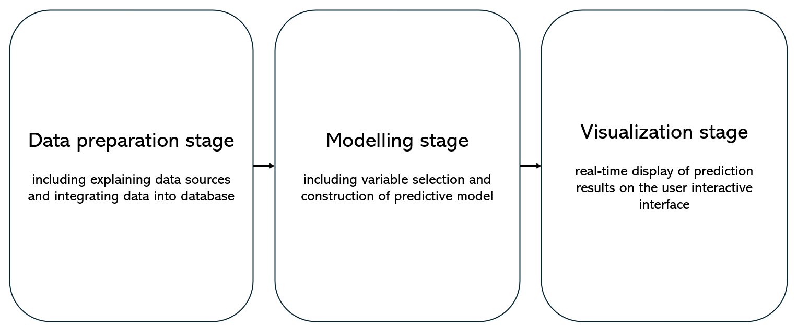
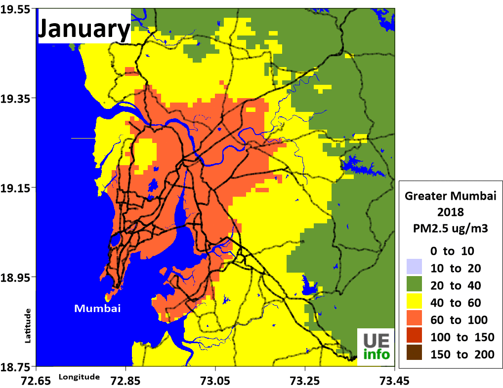

```{r xaringan-all, echo=FALSE, results='hide'}
library(xaringan)
library(xaringanExtra)
library(knitr)
xaringanExtra::use_panelset()
```


# Why? The Necessity of a New Paradigm

<div style="display: flex; align-items: center; justify-content: space-between;">
  <div style="flex: 1; text-align: left;">
    <!-- Your image goes here -->
    
  </div>
  <div style="flex: 1; padding-left: 30px; font-size: x-large;">
  <!-- Your text goes here -->
  Introduce the App UI
</div>
</div>

```{r setup, include=FALSE}
options(htmltools.dir.version = FALSE)

```

---
class: center, bottom
background-image: url("./assets/APP2.png")
background-size: cover
# New Features Visualization

<table>
  <thead>
    <tr>
      <th>Feature</th>
      <th>Type</th>
      <th>Description</th>
    </tr>
  </thead>
  <tbody>
    <tr>
      <td>Interactive Maps</td>
      <td>Visualization</td>
      <td>Identify pollution hotspots at a glance</td>
    </tr>
    <tr>
      <td>Graphs and Charts</td>
      <td>Visualization</td>
      <td>Visualize trends and changes over time</td>
    </tr>
    <tr>
      <td>Custom Alerts</td>
      <td>Approach</td>
      <td>Notifications for critical levels detected</td>
    </tr>
    <tr>
      <td>Predict through change</td>
      <td>Approach</td>
      <td>Identify possible pollution hotspots after changing policy</td>
    </tr>
  </tbody>
</table>


---

# Case Study Spotlight: 

AQI (https://www.aqi.in/dashboard/india/maharashtra/mumbai)

[Move to another topic]

---
# Output Utilization

<div style="position: absolute; top: 50%; left: 50%; transform: translate(-50%, -50%); width: 100%; text-align: center;">
    <ul style="list-style: inside;">
        <!-- Bullet point text goes here -->
        <li><strong>Policy Suggestions:</strong> Provides recommendations based on data analysis, offering a path to healthier environments.</li>
        <br/>
        <li><strong>Actionable Reports:</strong> Delivers clear, concise, and compelling reports that can influence policy and public opinion.</li>
    </ul>
</div>

## In detail...

---

# Data-Driven Action

Data Requirements and Integration

- New Data Addition: Seamlessly incorporates new data sets to keep the platform current and comprehensive.

- Enhanced Visualization: Innovative visual tools that translate complex data into actionable insights.

- Fresh Approach: Integrates with existing monitoring systems, enhancing them with new capabilities and perspectives.


---
class: center

# Tables for Data Requirements

| Pollutant Type | Sources | Impact | Real-Time Detection | Historical Data |
|----------|----------|----------|----------|----------|
| CO2    | Industry     | Air Quality | Yes | 10 Years |


| Existing Platform | Data Provided | Integration Method | New Capabilities |
|----------|----------|----------|----------|----------|
| Air Quality Index(AQI)    | AQI Levels | API Access | Real-Time Alerts |

---

# How to predict the air quality index selected by the user

### The technical workflow behind the APP

```{r echo=FALSE, out.width='100%', fig.align='center'}

```

---

# Data preparation stage

### Three sources

*1.* Air pollution data (air quality indicators) 

Source: AQI, monitoring station

| Variable | Units | Effect |
|----------|-------|--------|
| $O_{3}, PM2.5, SO_{2}, CO, NO_{2}$ | $\mu g / m^{3}$ | As the dependent variable, will be predicted |

---

# Data preparation stage 2

*2.* Meteorological data 

Source: AQI, monitoring station

Effect:

- Related studies show that meteorological variables can affect air quality

- Provide more potentially influential variables

| Variable | Units | 
|----------|-------|
| Temperature | Degrees celsius |
| Relative humidity | Percentage |
| Solar radiation | $W/m^{2}$ |
| Wind speed | $m/s$ |
| Precipitation|$Mm$ |
| Wind direction | Degrees |
| Pressure | $Mb$ |

---

# Data preparation stage 3

*3.* Remote sensing data

Landsat-8 data

| Variable | Units | Effect |
|----------|-------|--------|
| Band 1-7 | Surface reflectance | Sunlight directly affects air quality |
| NDVI, SAVI, EVI | - | Vegetation is also related to air quality |
| LST | Degrees celsius | Related studies have also considered LST as a potential influencing factor |

normalised difference vegetation index (NDVI)

soil-adjusted vegetation index (SAVI)

enhanced vegetation index (EVI)

land surface temperature (LST)

---

# Modelling stage

#### Predict air quality indicators using land use regression (LUR) models

  Four machine learning techniques:

multiple linear regression (MLR), multilayer perceptron (MLP), 
support vector regression (SVR), random forest regression (RFR)
  

  Model building process:

  - Select independent variables (user select )
  
  - Select dependent variables, using Bayesian information criteria (BIC) 
  
  - Determine metrics (RMSE, $R^{2}$)
  
  - Divide the dataset into train, validation and test set, 
  
  - Spatial cross-validation
  
  - Train and test the four models, and choose a better model
  
  - Execute prediction

---

# Visualization stage

### What is presented to the user is an interactive map

Using geographical information from remote sensing data, prediction results can be displayed on an interactive map in real time.

Similar visualization:

```{r echo=FALSE, out.width='60%', fig.align='center'}

```

---
class: center, middle

# Thanks!

Our tool is not just an app; it's a movement towards a cleaner, safer, and more sustainable world. It's our commitment to the future of our planet. 🌱
