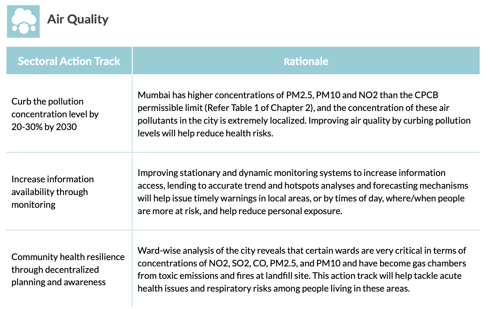
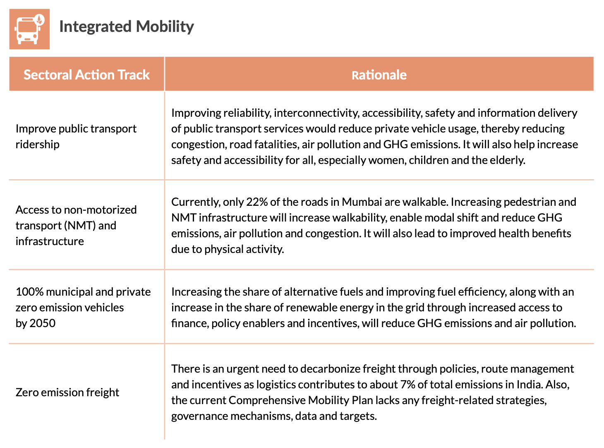

```{r xaringan-all, echo=FALSE, message=FALSE, warning=FALSE, results='hide'}
library(xaringan)
library(xaringanExtra)
library(knitr)
library(RefManageR)
library(knitcitations)
library(tidyverse)
library(knitr)
library(kableExtra)
library(readxl)
library(fs)
library(here)
```


```{r echo=FALSE}
BibOptions(check.entries = FALSE,
           bib.style = "authoryear",
           cite.style = "authoryear",
           style = "markdown",
           hyperlink = TRUE,
           dashed = FALSE,
           no.print.fields=c("doi", "url", "urldate", "issn"))
myBib <- ReadBib("./CASA0023_Group_Presentation.bib", check = FALSE)
```


## Policies: Global Agendas

·**Global Agendas Alignment**: United Nations Framework Convention on Climate Change (UNFCCC) Article 4, New Urban Agenda (65, 75, 79), and SDGs (3, 11, 13).

.panelset[
.panel[.panel-name[**UNFCCC I**]

**Chapter 4 Commitment**

* (b) Formulate, implement, publish and regularly update national and, where appropriate, regional programmes containing measures to mitigate climate change **by addressing anthropogenic emissions by sources and removals by sinks** of all greenhouse gases not controlled by the Montreal Protocol, and measures to facilitate **adequate adaptation** to climate change

* (c) Promote and cooperate in the development, application and diffusion, including transfer, of technologies, practices and processes that **control, reduce or prevent anthropogenic emissions of greenhouse gases** not controlled by the Montreal Protocol in all relevant sectors, including the *energy, transport, industry, agriculture, forestry and waste management sectors*

.normal-font[
Source: [UNFCCC](https://unfccc.int/resource/docs/convkp/conveng.pdf)
]
]

.panel[.panel-name[**UNFCCC II**]

**Chapter 4 Commitment**

* (d) **Promote sustainable management**, and promote and cooperate in the conservation and enhancement, as appropriate, of **sinks and reservoirs of all greenhouse gases** not controlled by the Montreal Protocol, including biomass, forests and oceans as well as *other terrestrial, coastal and marine ecosystems*;

.normal-font[
Source: [UNFCCC](https://unfccc.int/resource/docs/convkp/conveng.pdf)
]
]

.panel[.panel-name[**New Urban Agenda I**]

* (65) We commit ourselves to facilitating the sustainable management of natural resources in **cities and human settlements** in a manner that **protects and improves the urban ecosystem** and environmental services, **reduces greenhouse gas emissions and air pollution** and promotes disaster risk reduction and management, by supporting the development of disaster risk reduction strategies and periodical assessments of disaster risk caused by natural and human-made hazards, including standards for risk levels, while **fostering sustainable economic development and protecting the well-being and quality of life of all persons** through environmentally sound urban and territorial planning, infrastructure and basic services.

.normal-font[
Source: [The New Urban Agenda](https://habitat3.org/the-new-urban-agenda/)
]
]

.panel[.panel-name[**New Urban Agenda I**]

* (75) We commit ourselves to encouraging national, subnational and local governments, as appropriate, to **develop sustainable, renewable and affordable energy and energy-efficient buildings and construction modes** and to promoting energy conservation and efficiency, which are essential to enable the **reduction of greenhouse gas** and black carbon emissions, ensure sustainable consumption and production patterns, help create new decent jobs, **improve public health** and reduce the costs of energy supply.

.normal-font[
Source: [The New Urban Agenda](https://habitat3.org/the-new-urban-agenda/)
]
]

.panel[.panel-name[**New Urban Agenda II**]

* (79) We commit ourselves to promoting international, national, subnational and local climate action, including **climate change adaptation and mitigation**, and to supporting the efforts of cities and human settlements, their inhabitants and all local stakeholders as important implementers. We further commit ourselves to **supporting building resilience and reducing emissions of greenhouse gases** from all relevant sectors. Such measures should be consistent with the goals of the Paris Agreement adopted under the United Nations Framework Convention on Climate Change, including holding the increase in the global average temperature to well below 2 degrees Celsius above pre- industrial levels and pursuing efforts to limit the temperature increase to 1.5 degrees Celsius above pre-industrial levels.

.normal-font[
Source: [The New Urban Agenda](https://habitat3.org/the-new-urban-agenda/)
]
]

.panel[.panel-name[**SDGs I**]

**Goal 3**: Ensure healthy lives and promote well-being for all at all ages: 

  Health and population: **reduce the number of deaths and illnesses from hazardous chemicals and pollution**.
  
**Goal 13**: Take urgent action to combat climate change and its impacts: 

  The 2030 Agenda for Sustainable Development, through paragraph 31 “calls for the widest possible international cooperation aimed at **accelerating the reduction of global greenhouse gas emissions** and addressing adaptation to the adverse impacts of climate change”. 

.normal-font[
Source: [SDGs](https://sdgs.un.org/goals)
]
]

.panel[.panel-name[**SDGs II**]

**Goal 11**: Make cities and human settlements inclusive, safe, resilient and sustainable: 

  The Johannesburg Plan of Implementation (JPOI) provided multiple anchor points for **sustainable transport**, in the context of infrastructure, public transport systems, goods delivery networks, affordability, efficiency and convenience of transportation, as well as **improving urban air quality and health**, and **reduce greenhouse gas emissions**. 

.normal-font[
Source: [SDGs](https://sdgs.un.org/goals)
]
]

]

---
## Policies: Local Actions I

*Location Actions Alignment: Mumbai Climate Action Plan 2022

```{r xaringan-panelset, echo=FALSE}
xaringanExtra::use_panelset()
```

.panelset.sideways[
.panel[.panel-name[**Air Quality**]

```{r echo=FALSE, out.width='100%', fig.align='left'}

```

.normal-font[
Source: [Mumbai Climate Action Plan 2022](https://ghhin.org/resources/mumbai-climate-action-plan-2022/)
]
]

.panel[.panel-name[**Integrated Mobility**]

```{r echo=FALSE, out.width='100%', fig.align='left'}

```

.normal-font[Source: [Mumbai Climate Action Plan 2022](https://ghhin.org/resources/mumbai-climate-action-plan-2022/)
]
]


]

---

## Policies: Local Actions II

*Location Actions Alignment: National Action Plan on Climate Change

.panelset[
.panel[.panel-name[**2.2.6. Clean Air Initiatives**]

In urban areas, one of the **major sources of air pollution is emissions from transport vehicles**. Steps taken to reduce such pollution include:

* (i) introduction of compressed natural gas (CNG) in Delhi and other cities; 

* (ii) retiring old, polluting vehicles;

* (iii) **strengthening of mass transportation as mentioned above**. 

Some state governments provide subsidies for purchase and use of electric vehicles. For thermal power plants, the installation of electrostatic precipitators is mandatory. In many cities, polluting industrial units have either been closed or shifted from residential areas.

.normal-font[
Source: [Government of India](https://moef.gov.in/moef/division/environment-divisions/climate-changecc-2/national-action-plan-on-climate-change/index.html)
]
]

.panel[.panel-name[**4.3. National Mission on Sustainable Habitat**]

A National Mission on Sustainable Habitat will be launched to make habitat sustainable through **improvements in energy efficiency in buildings**, management of solid waste and **modal shift to public transport**. 

(i). **The Energy Conservation Building Code**, which addresses the design of new and large commercial buildings to optimize their energy demand, will be extended in its application and incentives provided for retooling existing building stock.

(iii). **Better urban planning and modal shift to public transport**. Making long term transport plans will facilitate the growth of medium and small cities in ways that ensure efficient and convenient public transport.

.normal-font[
Source: [Government of India](https://moef.gov.in/moef/division/environment-divisions/climate-changecc-2/national-action-plan-on-climate-change/index.html)
]
]

]

---

## Goals

### <span style="font-size:0.8em;">Enhancing Air Quality

* Propose strategies for reducing air pollution to meet UNFCCC, New Urban Agenda, and SDGs mandates.

* Curb pollution levels by 20-30% by 2030.

* Implement decentralized planning for community health resilience.

### <span style="font-size:0.8em;">Integrated Mobility for Sustainable Development

* Improve public transport ridership.

* Provide access to non-motorized transport.

* Aim for 100% zero-emission vehicles by 2050.

---

## Benefits to the City and Population

<span style="font-size:1.5em; font-weight:bold;">Health Benefits

  * Reduced health risks by curbing air pollution levels.

  * Improved urban air quality leading to enhanced public health.

<span style="font-size:1.5em; font-weight:bold;">Economic and Social Advancements

  * Sustainable transport systems contributing to job creation.
  
  * Decarbonizing freight to improve logistics and reduce emissions.

<span style="font-size:1.5em; font-weight:bold;">Long-term Sustainability

  * Strengthening mass transportation aligns with energy efficiency initiatives and sustainable urban planning.
  
  * Ensuring a safer, more inclusive urban environment for all citizens.

---
# Why? The Necessity of a New Paradigm

<div style="display: flex; align-items: center; justify-content: space-between;">
  <div style="flex: 1; text-align: left;">
    <!-- Your image goes here -->
    
  </div>
  <div style="flex: 1; padding-left: 30px; font-size: x-large;">
  <!-- Your text goes here -->
  Introduce the App UI
</div>
</div>

```{r setup, include=FALSE}
options(htmltools.dir.version = FALSE)

```

---
class: center, bottom
background-image: url("./assets/APP2.png")
background-size: cover
# New Features Visualization

<table>
  <thead>
    <tr>
      <th>Feature</th>
      <th>Type</th>
      <th>Description</th>
    </tr>
  </thead>
  <tbody>
    <tr>
      <td>Interactive Maps</td>
      <td>Visualization</td>
      <td>Identify pollution hotspots at a glance</td>
    </tr>
    <tr>
      <td>Graphs and Charts</td>
      <td>Visualization</td>
      <td>Visualize trends and changes over time</td>
    </tr>
    <tr>
      <td>Custom Alerts</td>
      <td>Approach</td>
      <td>Notifications for critical levels detected</td>
    </tr>
    <tr>
      <td>Predict through change</td>
      <td>Approach</td>
      <td>Identify possible pollution hotspots after changing policy</td>
    </tr>
  </tbody>
</table>


---

# Case Study Spotlight: 

AQI (https://www.aqi.in/dashboard/india/maharashtra/mumbai)

[Move to another topic]

---
# Output Utilization

<div style="position: absolute; top: 50%; left: 50%; transform: translate(-50%, -50%); width: 100%; text-align: center;">
    <ul style="list-style: inside;">
        <!-- Bullet point text goes here -->
        <li><strong>Policy Suggestions:</strong> Provides recommendations based on data analysis, offering a path to healthier environments.</li>
        <br/>
        <li><strong>Actionable Reports:</strong> Delivers clear, concise, and compelling reports that can influence policy and public opinion.</li>
    </ul>
</div>

## In detail...

---

# Data-Driven Action

Data Requirements and Integration

- New Data Addition: Seamlessly incorporates new data sets to keep the platform current and comprehensive.

- Enhanced Visualization: Innovative visual tools that translate complex data into actionable insights.

- Fresh Approach: Integrates with existing monitoring systems, enhancing them with new capabilities and perspectives.


---
class: center

# Tables for Data Requirements

| Pollutant Type | Sources | Impact | Real-Time Detection | Historical Data |
|----------|----------|----------|----------|----------|
| CO2    | Industry     | Air Quality | Yes | 10 Years |


| Existing Platform | Data Provided | Integration Method | New Capabilities |
|----------|----------|----------|----------|----------|
| Air Quality Index(AQI)    | AQI Levels | API Access | Real-Time Alerts |

---

# How to predict the air quality index selected by the user

### The technical workflow behind the APP

```{r echo=FALSE, out.width='100%', fig.align='center'}
knitr::include_graphics('img/technical_workflow.png')
```

---

# Data preparation stage

### Three sources

*1.* Air pollution data (air quality indicators)

Source: AQI, monitoring station

| Variable | Units | Effect |
|----------|-------|--------|
| $O_{3}, PM2.5, SO_{2}, CO, NO_{2}$ | $\mu g / m^{3}$ | As the dependent variable, will be predicted |

---

# Data preparation stage 2

*2.* Meteorological data 

Source: AQI, monitoring station

Effect: Related studies `r Citep(myBib,"Liu2007", "Zhang2018")` show that meteorological variables can affect air quality

| Variable | Units | 
|----------|-------|
| Temperature | Degrees celsius |
| Relative humidity | Percentage |
| Solar radiation | $W/m^{2}$ |
| Wind speed | $m/s$ |
| Precipitation|$Mm$ |
| Wind direction | Degrees |
| Pressure | $Mb$ |

---

# Data preparation stage 3

*3.* Remote sensing data

Landsat-8 data

| Variable | Units | Effect |
|----------|-------|--------|
| Band 1-7 | Surface reflectance | Used to calculate other variables |
| NDVI, SAVI, EVI | - | Vegetation is also related to air quality `r Citep(myBib,"Jia2014a", "Zhang2016a")` |
| LST | Degrees celsius | Related studies have also considered LST as a potential influencing factor `r Citep(myBib,"Chen2014")` |

Normalised difference vegetation index (NDVI), soil-adjusted vegetation index (SAVI), enhanced vegetation index (EVI), land surface temperature (LST)

---

# Modelling stage

#### Predict air quality indicators using land use regression (LUR) models

Four machine learning techniques: 
multiple linear regression (MLR), multilayer perceptron (MLP), 
support vector regression (SVR), random forest regression (RFR)

Model building process:

- Select independent variables (user select )
  
- Select dependent variables, using Bayesian information criteria (BIC) 
  
- Determine metrics (RMSE, $R^{2}$)
  
- Divide the dataset into train, validation and test set, 
  
- Spatial cross-validation
  
- Train and test the four models, and choose a better model
  
- Execute prediction

Source: `r Citep(myBib,"Alvarez-Mendoza2019", "Lopez2023")`

---

# Visualization stage

#### What is presented to the user is an interactive map

Using geographical information from remote sensing data, prediction results can be displayed on an interactive map in real time.

Similar visualization:

```{r echo=FALSE, out.width='50%', fig.align='center'}
knitr::include_graphics('img/visual_result.gif')
```

Source: `r Citep(myBib,"UrbanEmissions.Info2024")`
---

# References

```{r results='asis', echo=FALSE, warning=FALSE}
PrintBibliography(myBib, start = 1, end = 5)
```

---

# References 2

```{r results='asis', echo=FALSE, warning=FALSE}
PrintBibliography(myBib, start = 6, end = 100)
```

---
class: center, middle

# Thanks!

Our tool is not just an app; it's a movement towards a cleaner, safer, and more sustainable world. It's our commitment to the future of our planet. 🌱